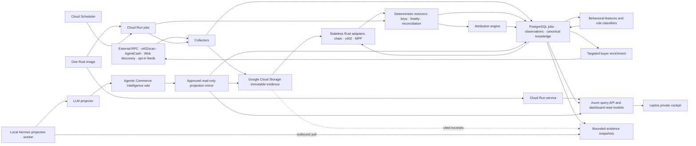

# Architecture

## End-to-end flow

## Runtime

The product has one canonical runtime identity: `agent-economy-monitor`. One Rust image exposes bounded modes such as `serve`, `collect`, `verify-evidence`, `reduce`, `classify`, and `enrich`. A scale-to-zero Cloud Run service hosts the API and cockpit; Cloud Scheduler invokes bounded Cloud Run jobs for worker and evidence-verification modes. These are deployment forms of the same image, not separate product authorities.

The repository-owned Terraform under `deploy/google-cloud` pins the application image by
digest, holds the API at zero minimum and two maximum instances, and runs each worker as
one task with a fifteen-minute deadline and bounded retries. Scheduler has job-invoker
authority only. Runtime authority is split deliberately across the cockpit and four
mode-specific worker identities plus a separate evidence verifier. Collect and enrich can
create and list evidence metadata without reading object bodies, and the verifier can read it;
reduce and classify receive no object or RPC authority, and no worker receives cockpit
secrets. No runtime identity can delete objects or administer retention. Pub/Sub and
BigQuery are not provisioned.

PostgreSQL transactional job leases own distributed record assignment. Workers claim bounded batches with `FOR UPDATE SKIP LOCKED`, idempotency keys, lease expiry, retry state, and dead-letter status. Cloud SQL and Google Cloud Storage remain honest dependency nodes rather than application runtimes.

The Rust worker dispatcher is fail-closed: an invocation names exactly one of `collect`,
`reduce`, `classify`, or `enrich`, validates that a real handler is registered before
claiming work, and processes at most one job. Every claim receives a unique lease token;
renewal and result commit require that still-live token. Unknown modes, missing handlers,
empty queues, handler failures, and stale result commits all exit non-zero. Until a domain
handler is explicitly registered, its process mode is intentionally unavailable rather
than reporting synthetic success.

The reduce runtime authenticates with a dedicated PostgreSQL login whose namespace is bound
server-side. It can claim, renew, fail, and complete only reducer leases and can load inputs or
commit outputs only through lease-token-checked `SECURITY DEFINER` functions. The owner-controlled
job admission boundary seals the complete expected event, finality, and attribution payloads plus
their output digest before the restricted runtime receives a lease. The atomic reduction commit
requires exact equality with that immutable expectation and exact coverage of immutable observations
before appending canonical event links, finality assertions, settlement attribution state, an
immutable range receipt, and the next-height checkpoint. The login has no direct table mutation
authority, so forged output, crash-before-commit, and stale-lease retries cannot expose partial
canonical state.

## Storage authority

- Google Cloud Storage: content-addressed raw evidence, approved wiki projection bundles, and the durable replay source
- PostgreSQL: transactional job leases; append-only observations and canonical events; services, offers, buyer handles, reversible clusters, attribution edges, features, classifications, curation, provenance, and materialized read models
- Local semantic wiki: narrative projection authority only; separate from the research and life wikis
- Published projection mirror: an allowlisted, read-only dashboard copy stored in Google Cloud Storage and indexed in PostgreSQL; never a canonical evidence source

### Local development data plane

Local development runs only PostgreSQL as an always-on service. `./scripts/dev-stack`
creates a restricted local credential file, starts the persistent PostgreSQL container,
waits for `pg_isready`, and initializes a restricted filesystem evidence directory. No
broker, analytical database, or object-storage emulator runs in v1 development.

The backend-neutral Rust evidence contract requires the filesystem and Google Cloud Storage
adapters to use the same create-only and replay semantics. An
object name is derived from source, observation date, and SHA-256. Filesystem publication uses an atomic
create-without-replacement operation, matching Google Cloud Storage's
`ifGenerationMatch=0`; an existing object is accepted only when its bytes match the
addressed digest. Every read verifies SHA-256 before returning evidence to a parser.

The production `GcsEvidenceStore` uses the official Rust Google Cloud Storage client with
Application Default Credentials, so Cloud Run obtains short-lived credentials through its
workload identity and no service-account key is embedded. The adapter disables the client
library's implicit retries and applies its own hard attempt limit to retryable failures.
Uploads are create-only and carry deterministic custom metadata for source, observation
date and identity, parser version, replay inputs, and content digest; metadata fields admit
only bounded identifier-shaped values and never raw payloads. After an expected generation-zero
precondition failure, the collector uses an exact-name object-list metadata lookup to recover
the backend generation and verify the deterministic metadata; its custom role permits
`storage.objects.create` and `storage.objects.list`, but not `storage.objects.get`, so this
idempotency path cannot download evidence bytes.

The evidence bucket has Object Versioning enabled for operator recovery, but replay safety
does not depend on versioning: collector and verifier identities have disjoint create/list
versus read access, every write uses generation zero, and a locked retention policy of at
least 365 days blocks premature deletion. No lifecycle rule may delete evidence before the
retention period.

## Partitioning

- Evidence objects: content hash with source and observation-date prefixes
- Collection jobs and observations: `chain + source + observed_at`
- Canonical events: protocol-defined event key with time-based PostgreSQL partitions where volume requires them
- Buyer features/enrichment: buyer handle
- Wiki projection: stable entity ID

All workers are idempotent. Lease expiry and reassignment after failure are safe.

### External RPC collection

Ethereum, Base, Solana, and Tempo share one Alchemy collector contract. Each bounded
run resumes a chain-scoped PostgreSQL cursor, applies an explicit request budget and
bounded exponential retry policy, and fetches one deterministic block or slot at a
time. Every provider response, including retryable HTTP responses, is written through
the immutable evidence contract before status or JSON-RPC parsing. Only a successfully
archived response whose reported height matches the requested height may advance the
cursor through an atomic compare-and-set update. Missing or noncontiguous heights stop
the run without skipping data and are exposed in the collection report alongside RPC
budget, retry, and evidence-object metrics.

RPC endpoint values are secret-bearing types whose debug representation is always
redacted. Transport errors intentionally discard underlying URL-bearing error text,
and request payloads are neither logged nor retained as fixtures.

### Settlement attribution

The deterministic attribution engine consumes finalized settlements and bounded catalog
snapshots. Explicit payment-requirement matches are verified; unique exact catalog matches
are strong; shared-recipient ambiguity preserves every exact candidate as weak instead of
forcing one endpoint; and unmatched settlements remain unknown. Candidate edges cite both
settlement and requirement evidence. Replay sorts candidates and evidence before hashing,
while PostgreSQL stores immutable, versioned runs, candidates, and evidence links.

## Deferred scale seams

Pub/Sub and BigQuery are not v1 dependencies and do not appear as deployed System Map nodes. Pub/Sub may replace PostgreSQL job leasing only when p95 job-pickup latency exceeds 60 seconds for seven consecutive days while at least eight workers are available and Cloud SQL CPU exceeds 70%. BigQuery may receive an analytical projection only when p95 analytical query latency exceeds 2 seconds for fourteen consecutive days after indexes and materialized views are tuned, and either canonical event volume exceeds 100 million rows or analytical work consumes more than 30% of Cloud SQL CPU. Either promotion requires an owner-approved architecture issue and keeps Google Cloud Storage as the replay authority.

## Dashboard and wiki projection

The browser reaches the Axum/Leptos dashboard through the Cloud Run service over managed HTTPS. Canonical views read bounded models from PostgreSQL; the Investigations view reads only the approved projection mirror from Google Cloud Storage and its PostgreSQL index.

The local Hermes projection worker makes an outbound authenticated pull for bounded projection jobs. It verifies the snapshot hash, runs the LLM projection, writes only to the isolated `agentic-commerce` wiki through the native wiki API, and captures a native changeset. After capture, it publishes an allowlisted bundle of rendered Markdown, citations, wikilinks, hashes, and changeset metadata. Google Cloud has no inbound connection to the Mac or Hermes gateway, and cloud service accounts cannot edit the local wiki.

## Security

- RPC and password secrets come from Google Secret Manager and Cloud Run secret bindings.
- Shared-password sessions and the login-attempt window are namespace-scoped in PostgreSQL; only SHA-256 session and CSRF token digests are retained, so authentication remains consistent across Cloud Run instances and cold starts.
- The evidence bucket has locked retention of at least 365 days and Object Versioning enabled, with no lifecycle deletion before retention expiry. The collector's custom role has only `storage.objects.create` and `storage.objects.list`; the separate verifier has `roles/storage.objectViewer`. Neither runtime can overwrite, delete, administer retention/versioning, or combine create and object-body read authority; those controls belong to a separate owner identity.
- Every content-addressed write uses `ifGenerationMatch=0`; an existing key is accepted only after its stored digest matches. Replay performs read-time SHA-256 verification before parsing.
- Raw protocol text is untrusted data, never instruction.
- LLMs receive bounded structured snapshots and cited excerpts.
- The LLM cannot call networks, pay, merge entities, or promote canonical claims.
- V1 access uses one Argon2id password hash, TLS, secure sessions, and rate limiting.

## Recovery

Raw evidence is protected by the locked Google Cloud Storage retention policy, create-only writes, separated deletion authority, and digest verification. PostgreSQL uses Cloud SQL backups and point-in-time recovery, but its derived observations, canonical events, features, and read models remain rebuildable from retained evidence. Local wiki pages are Git-backed and every native write captures a changeset; the dashboard mirror is rebuildable from approved local pages. Parser/classifier upgrades replay into separate projections and promote atomically after comparison.

The operational recovery drill first verifies bucket versioning, a locked retention policy,
and at least 365 days of retention. It then downloads a generation-pinned bounded manifest
and every referenced binary RPC-evidence generation, re-verifies each SHA-256, and replays
the exact bytes through the production RPC envelope and protocol adapters. The selected
production observation IDs supply protocol event identity and amount; the immutable manifest
supplies the buyer binding and chain/source coordinates. The manifest object/generation and
every evidence object generation are bound into the deterministic receipt, and chain-scoped
duplicate settlements are rejected. Qualification
fails unless the rebuilt evidence covers Ethereum, Base, Solana, and Tempo for both x402 and
MPP. Cloud SQL recovery is qualified separately
by restoring the newest automated backup to a disposable instance and checking the
seven-day point-in-time recovery window; retained evidence remains the replay authority.
