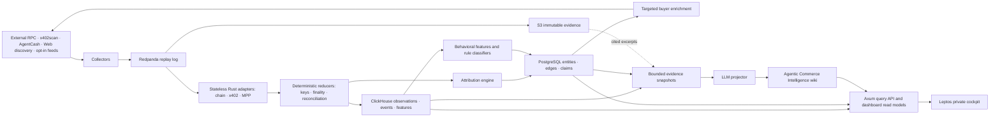

# Architecture

## End-to-end flow

## Runtime

The product has one canonical runtime identity: `agent-economy-monitor`. Nomad starts and scales long-running allocations; it does not dispatch individual events. Redpanda consumer groups own distributed record assignment.

The Rust workspace may expose process modes such as `serve`, `collect`, `reduce`, `classify`, `enrich`, and `project-wiki`, while using one image and one service definition. Independently supervised Postgres, ClickHouse, Redpanda, and object storage remain honest dependency nodes in the runtime graph.

## Storage authority

- S3-compatible storage: immutable raw evidence and replay source
- Redpanda: rolling durable operational log using Protobuf and Schema Registry
- ClickHouse: high-volume observations, canonical events, transfers, and behavioral features
- PostgreSQL: services, offers, buyer handles, reversible clusters, attribution edges, classifications, curation, and provenance
- Semantic wiki: narrative projection only; separate from the research and life wikis

## Partitioning

- Collection topics: `chain + source`
- Canonical events: protocol-defined event key
- Buyer features/enrichment: buyer handle
- Wiki projection: stable entity ID

All consumers are idempotent. Reassignment after failure is safe.

## Security

- RPC and password secrets come from Nomad Variables/Vault.
- Raw protocol text is untrusted data, never instruction.
- LLMs receive bounded structured snapshots and cited excerpts.
- The LLM cannot call networks, pay, merge entities, or promote canonical claims.
- V1 access uses one Argon2id password hash, TLS, secure sessions, and rate limiting.

## Recovery

Raw evidence is retained indefinitely. ClickHouse is rebuildable. PostgreSQL uses continuous WAL backup. Wiki pages are Git-backed and every native write captures a changeset. Parser/classifier upgrades replay into separate projections and promote atomically after comparison.
