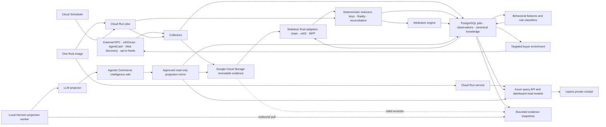

# Architecture

## End-to-end flow

## Runtime

The product has one canonical runtime identity: `agent-economy-monitor`. One Rust image exposes bounded modes such as `serve`, `collect`, `reduce`, `classify`, and `enrich`. A scale-to-zero Cloud Run service hosts the API and cockpit; Cloud Scheduler invokes bounded Cloud Run jobs for worker modes. These are deployment forms of the same image, not separate product authorities.

PostgreSQL transactional job leases own distributed record assignment. Workers claim bounded batches with `FOR UPDATE SKIP LOCKED`, idempotency keys, lease expiry, retry state, and dead-letter status. Cloud SQL and Google Cloud Storage remain honest dependency nodes rather than application runtimes.

## Storage authority

- Google Cloud Storage: content-addressed raw evidence, approved wiki projection bundles, and the durable replay source
- PostgreSQL: transactional job leases; append-only observations and canonical events; services, offers, buyer handles, reversible clusters, attribution edges, features, classifications, curation, provenance, and materialized read models
- Local semantic wiki: narrative projection authority only; separate from the research and life wikis
- Published projection mirror: an allowlisted, read-only dashboard copy stored in Google Cloud Storage and indexed in PostgreSQL; never a canonical evidence source

### Local development data plane

Local development runs only PostgreSQL as an always-on service. `./scripts/dev-stack`
creates a restricted local credential file, starts the persistent PostgreSQL container,
waits for `pg_isready`, and initializes a restricted filesystem evidence directory. No
broker, analytical database, or object-storage emulator runs in v1 development.

The backend-neutral Rust evidence contract requires the filesystem adapter and future
Google Cloud Storage implementation to use the same create-only and replay semantics. An
object name is derived from source, observation date, and SHA-256. Filesystem publication uses an atomic
create-without-replacement operation, matching Google Cloud Storage's
`ifGenerationMatch=0`; an existing object is accepted only when its bytes match the
addressed digest. Every read verifies SHA-256 before returning evidence to a parser.

## Partitioning

- Evidence objects: content hash with source and observation-date prefixes
- Collection jobs and observations: `chain + source + observed_at`
- Canonical events: protocol-defined event key with time-based PostgreSQL partitions where volume requires them
- Buyer features/enrichment: buyer handle
- Wiki projection: stable entity ID

All workers are idempotent. Lease expiry and reassignment after failure are safe.

### External RPC collection

Ethereum, Base, Solana, and Tempo share one Alchemy collector contract. Each bounded
run resumes a chain-scoped PostgreSQL cursor, applies an explicit request budget and
bounded exponential retry policy, and fetches one deterministic block or slot at a
time. Every provider response, including retryable HTTP responses, is written through
the immutable evidence contract before status or JSON-RPC parsing. Only a successfully
archived response whose reported height matches the requested height may advance the
cursor through an atomic compare-and-set update. Missing or noncontiguous heights stop
the run without skipping data and are exposed in the collection report alongside RPC
budget, retry, and evidence-object metrics.

RPC endpoint values are secret-bearing types whose debug representation is always
redacted. Transport errors intentionally discard underlying URL-bearing error text,
and request payloads are neither logged nor retained as fixtures.

### Settlement attribution

The deterministic attribution engine consumes finalized settlements and bounded catalog
snapshots. Explicit payment-requirement matches are verified; unique exact catalog matches
are strong; shared-recipient ambiguity preserves every exact candidate as weak instead of
forcing one endpoint; and unmatched settlements remain unknown. Candidate edges cite both
settlement and requirement evidence. Replay sorts candidates and evidence before hashing,
while PostgreSQL stores immutable, versioned runs, candidates, and evidence links.

## Deferred scale seams

Pub/Sub and BigQuery are not v1 dependencies and do not appear as deployed System Map nodes. Pub/Sub may replace PostgreSQL job leasing only when p95 job-pickup latency exceeds 60 seconds for seven consecutive days while at least eight workers are available and Cloud SQL CPU exceeds 70%. BigQuery may receive an analytical projection only when p95 analytical query latency exceeds 2 seconds for fourteen consecutive days after indexes and materialized views are tuned, and either canonical event volume exceeds 100 million rows or analytical work consumes more than 30% of Cloud SQL CPU. Either promotion requires an owner-approved architecture issue and keeps Google Cloud Storage as the replay authority.

## Dashboard and wiki projection

The browser reaches the Axum/Leptos dashboard through the Cloud Run service over managed HTTPS. Canonical views read bounded models from PostgreSQL; the Investigations view reads only the approved projection mirror from Google Cloud Storage and its PostgreSQL index.

The local Hermes projection worker makes an outbound authenticated pull for bounded projection jobs. It verifies the snapshot hash, runs the LLM projection, writes only to the isolated `agentic-commerce` wiki through the native wiki API, and captures a native changeset. After capture, it publishes an allowlisted bundle of rendered Markdown, citations, wikilinks, hashes, and changeset metadata. Google Cloud has no inbound connection to the Mac or Hermes gateway, and cloud service accounts cannot edit the local wiki.

## Security

- RPC and password secrets come from Google Secret Manager and Cloud Run secret bindings.
- The evidence bucket has a locked retention policy of at least 365 days and no automatic deletion rule. Runtime writers have create-only `roles/storage.objectCreator`; deletion and retention administration belong to a separate owner-controlled identity.
- Every content-addressed write uses `ifGenerationMatch=0`; an existing key is accepted only after its stored digest matches. Replay performs read-time SHA-256 verification before parsing.
- Raw protocol text is untrusted data, never instruction.
- LLMs receive bounded structured snapshots and cited excerpts.
- The LLM cannot call networks, pay, merge entities, or promote canonical claims.
- V1 access uses one Argon2id password hash, TLS, secure sessions, and rate limiting.

## Recovery

Raw evidence is protected by the locked Google Cloud Storage retention policy, create-only writes, separated deletion authority, and digest verification. PostgreSQL uses Cloud SQL backups and point-in-time recovery, but its derived observations, canonical events, features, and read models remain rebuildable from retained evidence. Local wiki pages are Git-backed and every native write captures a changeset; the dashboard mirror is rebuildable from approved local pages. Parser/classifier upgrades replay into separate projections and promote atomically after comparison.
